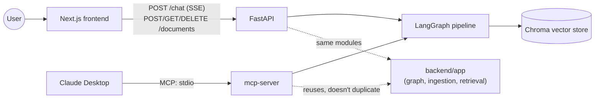
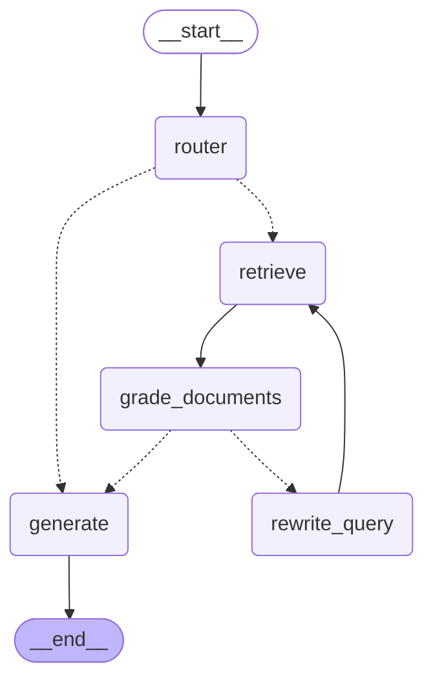

# Ask My Docs

A document Q&A app built around a **self-correcting RAG pipeline** — not a naive retrieve-then-generate chain. Ask a question, and the system routes it, retrieves candidate chunks, grades whether they're actually sufficient, rewrites the query and re-retrieves (up to a hard cap) if not, then generates a grounded, cited answer — or explicitly says the context was insufficient rather than hallucinating.

Three ways in, one shared pipeline:
- **[`backend/`](backend/README.md)** — FastAPI + [LangGraph](https://github.com/langchain-ai/langgraph), SSE-streamed chat, document ingestion into Chroma.
- **[`mcp-server/`](mcp-server/README.md)** — the same pipeline exposed as MCP tools for Claude Desktop (`query_documents`, `add_document`, `list_documents`).
- **[`frontend/`](frontend/README.md)** — a minimal Next.js chat UI with streaming responses and expandable source citations.

## Architecture



The pipeline itself — router → retrieve → grade → bounded rewrite loop → generate — compiled straight from the running code (`app.graph.build_default_graph().get_graph().draw_mermaid()`, [backend/app/graph/build.py](backend/app/graph/build.py)):



## Quickstart

```bash
git clone <this repo> && cd ask-my-docs
cp .env.example .env   # fill in ANTHROPIC_API_KEY and OPENAI_API_KEY
docker compose up --build
```

Then open [http://localhost:3000](http://localhost:3000). The API is at `http://localhost:8000` ([`GET /health`](backend/app/main.py)).

Without an `.env`, the stack still starts, but every LLM/embedding call fails with a structured error (never a bare 500 or a silent crash — see [Design decisions](#design-decisions)) instead of hallucinating an answer.

Running a service outside Docker for development? Each has its own README: [backend](backend/README.md), [frontend](frontend/README.md), [mcp-server](mcp-server/README.md).

## MCP / Claude Desktop setup

`mcp-server/` exposes the same pipeline as three MCP tools over stdio. Add to `claude_desktop_config.json`:

```json
{
  "mcpServers": {
    "ask-my-docs": {
      "command": "uv",
      "args": ["--directory", "/absolute/path/to/ask-my-docs/mcp-server", "run", "server.py"]
    }
  }
}
```

Restart Claude Desktop, then ask it to add a document, query it, or list what's indexed. Full walkthrough in [mcp-server/README.md](mcp-server/README.md).

## Screenshots

The chat UI's empty state and document sidebar, running locally via `npm run dev`:

- Sidebar: title, drag-drop zone, empty document list ("No documents yet.")
- Chat panel: centered prompt ("Ask a question about your documents") and the input bar

*(This machine has no `ANTHROPIC_API_KEY`/`OPENAI_API_KEY` configured, so a full happy-path screenshot with a real streamed answer and source chips isn't available here — the UI and error-handling paths are otherwise fully built and verified; see [MEMORY.md](MEMORY.md) for what was manually checked each phase.)*

## Design decisions

**The self-correcting retrieval loop.** A naive RAG pipeline retrieves once and generates regardless of whether the retrieved chunks are any good. Here, `grade_documents` acts as an LLM-as-judge over the retrieved chunks (structured output, not string parsing — `GradeResult` with per-chunk relevance) and only proceeds to `generate` if it judges the context sufficient. Otherwise the question gets rewritten (`rewrite_query`, informed by the *original* question so it doesn't drift) and re-retrieved.

**Why the rewrite loop is provably bounded, not just "usually fine."** The cap (`MAX_REWRITES`, default 2) is enforced in exactly one place: `grade_documents_node` computes `limited_context = (not sufficient) and (rewrite_count >= max_rewrites)` and writes it into state; the routing function that decides `generate` vs. `rewrite_query` only *reads* that flag back — it never independently re-derives the condition. That single-writer design is what makes the loop's bound a property of the code rather than an invariant every call site has to remember to uphold — see [backend/app/graph/nodes.py](backend/app/graph/nodes.py) and [backend/app/graph/build.py](backend/app/graph/build.py). It's covered by tests that drive an always-insufficient grader and assert the rewrite count never exceeds the cap ([backend/tests/test_grade_rewrite.py](backend/tests/test_grade_rewrite.py)).

**Refusing to hallucinate under uncertainty.** When the rewrite cap is hit, or when retrieval is attempted but nothing relevant is found, `generate` is told explicitly and produces a "the documents don't have enough information" answer instead of quietly filling the gap from the model's own knowledge — three distinct prompts for three distinct situations (general chat with no documents consulted; retrieval attempted but empty; normal grounded generation), not one branch overloaded to mean two different things. (A real bug of exactly that shape — collapsing "no retrieval needed" and "retrieval found nothing" into the same code path — was caught in manual review during Phase 2 and is documented in [MEMORY.md](MEMORY.md).)

## Repo layout

```
ask-my-docs/
├── backend/       FastAPI + LangGraph pipeline + ingestion/retrieval
├── mcp-server/    MCP tools reusing backend/app directly (path dependency, not a copy)
├── frontend/      Next.js chat UI
├── docker-compose.yml
├── .env.example
└── MEMORY.md      per-phase build log — what shipped, what was found in review, what's next
```

## Development

See [AGENTS.md](AGENTS.md) for the phase-by-phase workflow this project was built with, and [MEMORY.md](MEMORY.md) for the full build log.
